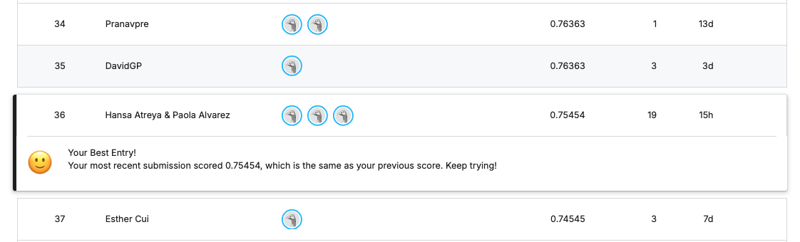

# CSE 144 Final Project — Transfer Learning Challenge

**Team:** Hansa Atreya (hatreya), Zhiyuan Song (zsong41), Paola Alvarez (palvare9)
**Course:** CSE 144, Spring 2026, UC Santa Cruz

## Kaggle Leaderboard

Our best public leaderboard score: **0.75454**


## Model Weights

Trained weights (~45 MB) are hosted on Google Drive:
[Download from Google Drive](PASTE_DRIVE_LINK_HERE)

## Setup

```bash
pip install -r requirements.txt
```

## Data

The competition dataset is pre-mounted on Kaggle at:
`/kaggle/input/competitions/ucsc-cse-144-spring-2026-final-project`
(with `/train` and `/test` subfolders).

## Training

Trains ResNet-18 for 50 epochs (lr=1e-4, Adam, seed 42) and writes `submission.csv`:

```bash
python train.py
```

## Inference

Loads the trained weights and generates `submission.csv` without retraining:

```bash
python predict.py --weights assets/<weights_file>.pth --test_dir /kaggle/input/competitions/ucsc-cse-144-spring-2026-final-project/test
```
